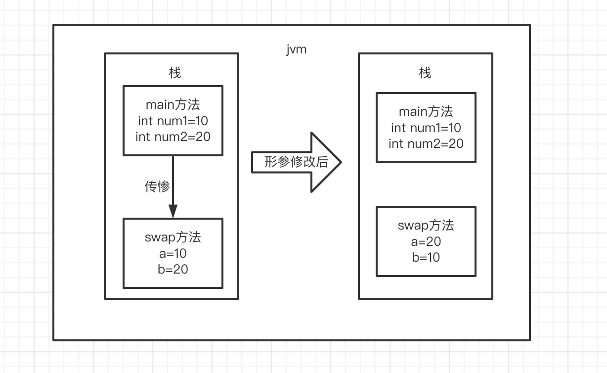

  # Java中传递方式？   
   ## 结论： Java中只有值传递，没有引用传递
    
在开始之前,我们先搞懂以下两个概念  
* 形参&实参
* 值传递&引用传递  
### 形参&实参
  方法的定义可能会用到 参数（有参的方法），参数在程序语言中分为：
  * **实参（实际参数）** ：用于传递给函数/方法的参数，必须有确定的值。
  * **形参（形式参数）** ：用于定义函数/方法，接收实参，不需要有确定的值。

  ```
    String hello = "Hello!";
    // hello 为实参
    sayHello(hello);
    // str 为形参
    void sayHello(String str) {
        System.out.println(str);
    }
```

### 值传递&引用传递
程序设计语言将实参传递给方法（或函数）的方式分为两种
* **值传递** ：方法接收的是实参值的拷贝，会创建副本。
* **引用传递**： 方法接受的直接是实参所引用的对象在堆中的地址，不会创建副本，对形参的修改会影响到实参
  
## 为什么Java只有值传递？
### 案例1:传递基本数据类型参数
~~~
    public static void main(String[] args) {
    int num1 = 10;
    int num2 = 20;
    swap(num1, num2);
    System.out.println("num1 = " + num1);
    System.out.println("num2 = " + num2);
}

public static void swap(int a, int b) {
    int temp = a;
    a = b;
    b = temp;
    System.out.println("a = " + a);
    System.out.println("b = " + b);
} 
~~~

输出结果：
~~~
    a=20
    b=10
    num1=10
    num2=20
~~~
分析：  
在swap()方法中，<code>a</code>，<code>b</code>的制进行交换，影不影响<code>num1</code>，<code>num2</code>。因为，<code>a</code>，<code>b</code>的值，只是将<code>num1</code>，<code>num2</code>的值进行复制过来的。也就是说，<code>a</code>，<code>b</code>相当于<code>num1</code>，</code><code>num2</code>的副本，副本的内容无论怎么修改，都不会影响到原数据本身

<!--  -->

通过上面的例子，我们已经知道一个方法不能修改基本数据类型的参数，但是当引用类型作为参数的是否一样，请看下面案例
###  案例2：引用数据类型参数
代码：
~~~
public static void main(String[] args) throws Exception {
        User user = new User();
        user.name = "zhangsan";
        user.age = 18;
        fun1(user);
        System.out.println(user.name);
        System.out.println(user.age);
}

static void fun1(User u){
    u.name="lisi";
    u.age=20;

    System.out.println(u.name);
    System.out.println(u.age);

}

public static class User{
    public String name;
    public int age;
    
}
~~~
输出
~~~
lisi
20
lisi
20
~~~

解析：  
 当把引用类型<code>user</code>作为参数时，并且在<code>fun1</code>中修改形参<code>u</code>的<code>name</code>，<code>age</code>属性时，在原有的实参<code>user</code>中<code>name</code>，<code>age</code>也被修改。看到上面的案例，很多人会觉得，当参数为引用类型的时候，传递方式为引用传递，但事实真的是是这样的吗？别慌，我们在看结合看一下下面的案例

### 案例3 引用数据类型参数
代码：
~~~
public static void main(String[] args) throws Exception {
        User user = new User();
        user.name = "zhangsan";
        user.age = 18;
        fun1(user);
        System.out.println(user.name);
        System.out.println(user.age);
}

static void fun1(User u){
    //重新new一个User
    u= new User();
    u.name="lisi";
    u.age=20;

    System.out.println(u.name);
    System.out.println(u.age);

}

public static class User{
    public String name;
    public int age;
    
}
~~~
输出：
~~~
lisi
20
zhangsan
18
~~~

解析：  
在fun1中我们对参数重新new一个新的<code>User</code>，在修改<code>name</code>，<code>age</code>属性，我们发现实参<code>user</code>的<code>name</code>，<code>age</code>并没有被修改，所以当参数为引用类型时，不是引用传递，也是值传递   

**重点：**  
当引用类型作为参数时，其实就是把引用类型的地址复制作为参数传递，所以在案例2中，实参和形参他们都是指向同一块地址，我们修改形参<code>u</code>时，实参<code>user</code>，的内容也被修改，在案例3中，当我们把形参<code>u</code>重新赋值的时候，实参和形参指向不同地址，所以我们在修改形参的<code>name</code>，<code>age</code>时并不会修改实参的<code>name</code>，<code>age</code>

# j

**Java中是值传递**


